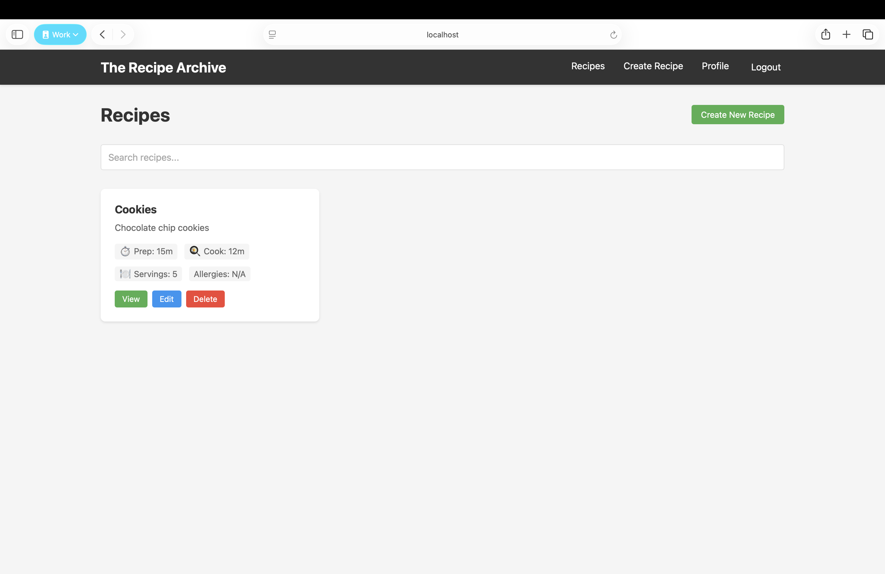
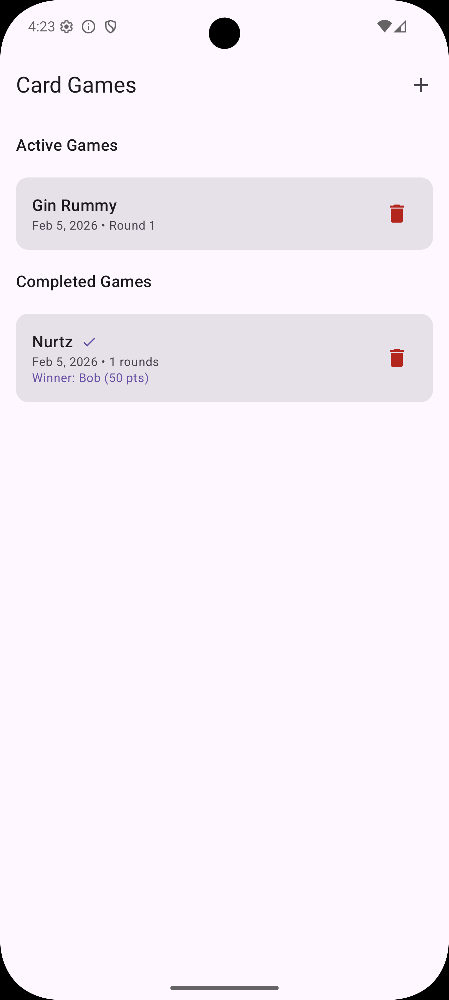
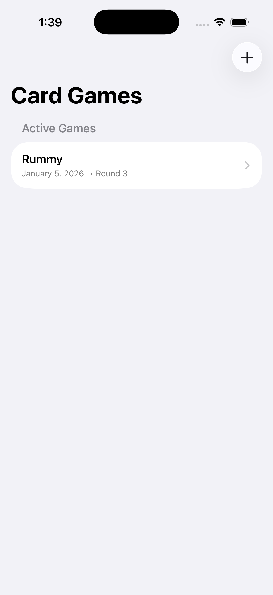
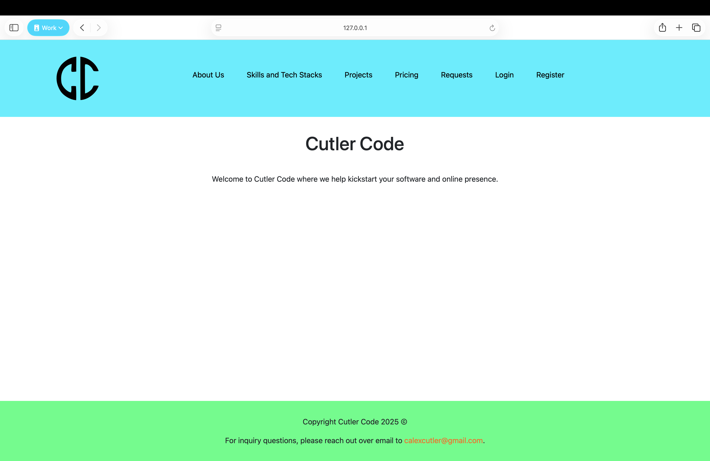

# Hi 👋, I'm Alex Cutler

**Full-Stack & Mobile Developer | Cloud, APIs, and Web/Mobile Applications**

## About Me

Recent Software Engineering graduate building production-ready applications with modern full-stack technologies.  Interested in cloud systems, distributed systems, and full-stack and mobile development.

I am available for part time freelance software development work.  Feel free to look through my <a href="https://cacutler.github.io/">GitHub Page</a> for further details.

- 🔭 I'm currently working on a **fitness and calorie tracker and workout planner**.
- 🌱 I'm currently learning **Flutter/Dart, FastAPI/Python, and PostgreSQL**.
- 💬 Ask me about **web (backend and frontend) and mobile development**.
- 📫 How to reach me **calexcutler@gmail.com**.
- 👨‍💻 All of my projects are available at my **[GitHub Profile](https://github.com/cacutler)**.
- 📄 Know about my experiences on my **[resume](https://drive.google.com/file/d/18a-ig5-SYhSh4E9Z4K_2VpRcbv2kTaJ6/view?usp=sharing)**.

**Profile Views** 

## My Core Tech Stack

**Languages**

**Frameworks**

**Databases**

**Cloud Platforms**

## Hire Me For:

- Backend Development
- Frontend Development
- Fullstack Development
- Mobile Development

## Recent Projects

- The Recipe Archive
    - This project aims to "digitize" family recipes by allowing users to add in and search through recipes.
    - It uses Java and Spring Boot for the backend, PostgreSQL for the database, and Svelte and SvelteKit for the frontend.
    - The frontend uses REST APIs to connect to the backend and JWTs for user authentication.
    - Screenshot:
    
- Card Game Point Tracker
    - This is a point tracking app used to help keep track of points during card games (think games like Wackee Six, Cover Your Assets, Skull King, etc.)
    - The iOS app is built with SwiftUI and the Android app is built with Kotlin and Jetpack Compose.
    - I wrote several unit and instrumented tests for both apps.
    - Android Screenshot:
    
    - iOS Screenshot:
    
- Cutler Code Business Website
    - This is a website for a personal business idea I have in mind for creating custom software for clients who wish to work with me.
    - It uses MySQL for the database and the Laravel PHP framework for both the frontend and backend.
    - The frontend uses dozens of REST APIs to communicate with the backend.
    - I wrote several unit and feature tests to test the website and added a small CI/CD pipeline with GitHub Actions to automate the test runner when I push code to the repository.
    - Screenshot:
    

## Featured AWS Project: Serverless Payment Clearinghouse

**Python | AWS Lambda | DynamoDB | Distributed Systems**

Designed and implemented a scalable serverless API that abstracts payment processing between merchants and multiple financial institutions.  The system simulates hight-volume transaction flow while enforcing strict SLA and security constraints.

Click to expand details

**🏗️ Architecture**

- **Amazon Web Services Lambda** for stateless transaction processing
- **Amazon Web Services DynamoDB** for merchant authentication and transaction logging
- REST-based integration with heterogeneous downstream banking APIs
- Token-based merchant authentication model

**⚙️ Engineering Highlights**

- Routed transaction across 5 vendor-specific banking APIs with differing schemas
- Normalized inconsistent downstream responses into a unified status model
- Enforced <3 second SLA with timeout handling and graceful degradation
- Simulated 100+ concurrent merchants to evaluate scalability and resilience
- Processed 700+ transactions under load conditions
- Designed with PCI-aware constraints (no sensitive card data persisted)
- Identified and resolved JSON schema validation issue discovered during production-style testing

**📈 Production Considerations**

- Designed for horizontal scalability using serverless architecture
- Implemented defensive JSON parsing and error handling
- Evaluated cost vs availability tradeoffs in free-tier cloud environment
- Future enhancements: IAM role-based auth, structured logging, rate limiting, circuit breaker pattern

Source code remains private due to academic requirements. Architecture and design details are shared for portfolio purposes.

## Additional Languages and Tools I Used

    
    
    
    
    
    
    
    
    
    
    
    
    
    
    
    
    
    
    
    
    
    
    
    
    
    
    
    
    
    
    
    
    
    
    
    
    
    
    
    
    
    

## How to Connect with Me

    
    
    
    
    
    
    
    

## My GitHub Stats

